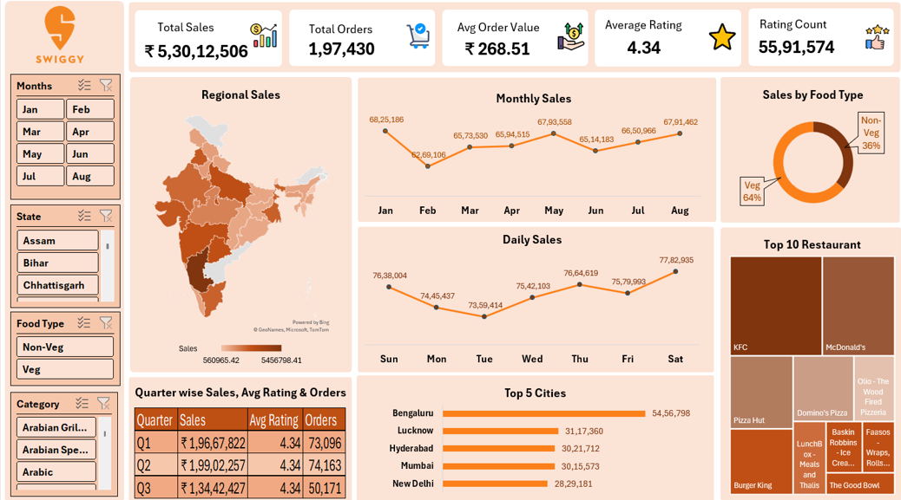

# Swiggy Sales MIS Dashboard
## Project Overview
This project is an Excel-based Sales MIS Dashboard created to analyze and present sales performance through key business metrics and interactive filters.
The dashboard provides a consolidated view of sales, orders, average order value, ratings, regional performance, monthly and daily sales trends, food type contribution, city performance, restaurant performance, and quarterly performance.
## Objective
The objective of this project is to convert sales data into an easy-to-understand management dashboard that can support regular MIS reporting and business performance analysis.
## Key KPIs
- Total Sales
- Total Orders
- Average Order Value
- Average Rating
- Rating Count
## Dashboard Analysis
The dashboard includes:
- Regional Sales analysis
- Monthly Sales trend
- Daily Sales analysis
- Sales by Food Type
- Top 5 Cities by Sales
- Top 10 Restaurants by Sales
- Quarter-wise Sales, Average Rating and Orders
- Interactive filters for Month
- State-level filtering
- Food Type filtering
- Category filtering
## Excel / MIS Skills Demonstrated
- Microsoft Excel dashboard creation
- Sales MIS reporting
- KPI reporting
- Data summarization
- Sales trend analysis
- Regional and city-level analysis
- Restaurant performance analysis
- Monthly and quarterly reporting
- Interactive dashboard filtering using Slicers
- Data visualization
- Management-oriented report presentation
### Additional Excel Techniques
- Pivot Tables
- Pivot Charts
- Excel formulas
- Slicers
- Data aggregation
## Business Insights Covered
The dashboard allows users to review:
- Overall sales and order performance
- Monthly sales movement
- Daily sales patterns
- Regional sales contribution
- City-level sales performance
- Restaurant-level performance
- Veg versus Non-Veg sales contribution
- Quarterly sales and order performance
- Rating-related performance indicators
## Dashboard Preview

## Tools Used
- Microsoft Excel
- Excel Dashboard
- Pivot Tables / Pivot Charts
- Slicers
- Excel formulas
- Data visualization
## Project Files
- `Swiggy_Sales_Data.xlsx` - Main Excel dashboard
- `Swiggy_Sales_Dashboard.png` - Dashboard preview
## Intended Use
This project is presented as a portfolio example for MIS Executive, MIS Analyst, Reporting Executive, and entry-level Business/Data Reporting roles.
## Author
Deelip Vishwakarma
## Note
The dashboard is a portfolio project intended to demonstrate Excel-based MIS reporting and sales analysis capabilities.
